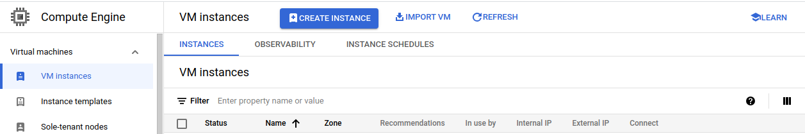
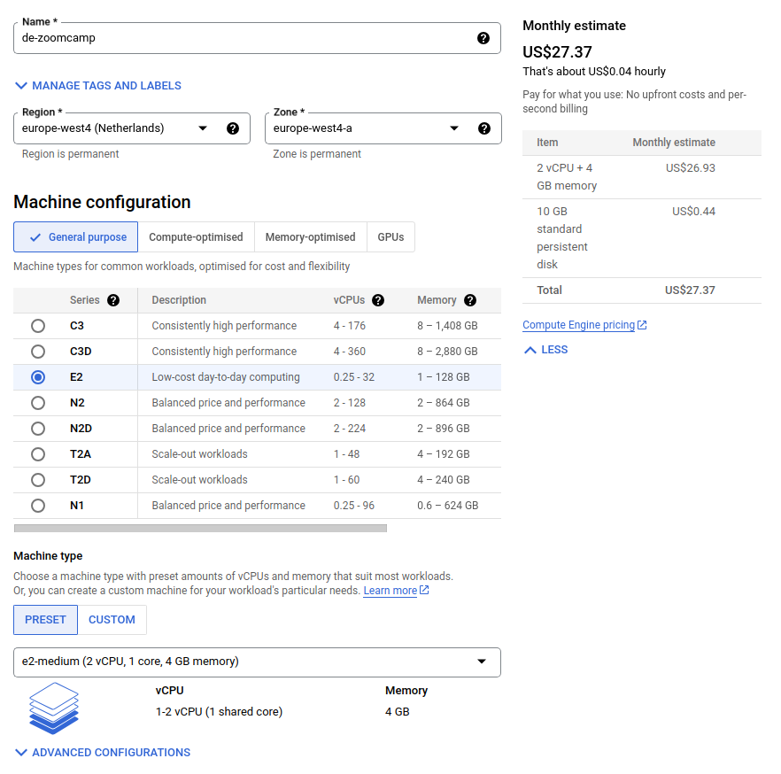

# Setting up the Google Cloud environment
[video](https://www.youtube.com/watch?v=ae-CV2KfoN0)

The aim here is to create the Google Cloud environment we will subsequently use. It can be summarised in a few steps:

- Create a new project and copy the .ssh pub key
- Create a VM
- Install anaconda (or miniconda), docker, terrraform
- remotely connect via the Remote SSH extension in VS Code, and open the ports we will need (e.g. 8080 for pgAdmin and 8888 for Jupyter Notebook)
- run a first terraform tf file for infrastructure creation
- learn how to stop or destroy the VM

> [!CAUTION]
> When you create a VM and stop it, you will not pay for the computing time, but you will still pay for the storage space (although the cost is much smaller).

[Intro video on the Google Cloud Platform](https://www.youtube.com/watch?v=18jIzE41fJ4) (~ 3 min)

Access the google cloud console here : [console.cloud.google.com](http://console.cloud.google.com/)

It is necessary to open a billing account using a credit card. There is an initial bonus of 300$. I used a prepaid credit card and it worked fine. In any case, the billing on the credit card - after you have run out of the initial 300$ credit - will not start unless you switch to a full account.

## Creating a new project and a VM
First of all create a new project. I called it `DE-zoomcamp-001`

Copy an ssh public key to Google Cloud. To do so, add an ssh_pub key to the project from the **Metadata** menu in the left panel. I created a `DE_zoomcamp.pub` key just for this zoomcamp.


In the **VM instances** create an instance




Select **europe-west4 (Netherlands) region** - US$ 27.37 a month (one of the cheapest) and select a small machine.




Switch Boot disk to Ubuntu 20.04 LTS and make sure you set the disk to 30 GB  (very little cost difference)


The generated external IP is `34.91.191.113`

**NB: the IP will change every time you destroy and create a new VM**. This means that if you use a `.ssh/config` file - as we see below, e.g. to connect via VS code - you need to update this file accordingly

In order to connect via ssh, you need to provide the identity - name of the key you generated - as well as the name defined in the key:

```bash
ssh -i ../.ssh/DE_zoomcamp machinery@34.91.191.113
```

To access in a simpler way, create a **config file in .ssh**. This will allow us to connect to the VM using `ssh de-zoomcamp`

```bash
# .ssh/config
Host de-zoomcamp
	HostName 34.91.191.113
	User machinery
	IdentityFile ~/.ssh/DE_zoomcamp 
```

Install **Anaconda** by downloading and executing the bash installer (actually I installed **[Miniconda](https://docs.conda.io/projects/miniconda/en/latest/)** and then installed jupyter in the base environment)

Install **Docker**

```bash
sudo apt update
sudo apt install docker.io
```

Clone the course repo

```bash
git clone https://github.com/DataTalksClub/data-engineering-zoomcamp.git
```

Add the current user to the docker group, so that we don’t need to sudo docker every time

```bash
sudo gpasswd -a $USER docker
sudo service docker restart
# then logout and login again to activate the membership
```

You can then test that docker is working e.g. with

```bash
docker run --rm -it alpine:latest sh
```

Install [docker compose](https://github.com/docker/compose/releases)

`wget https://github.com/docker/compose/releases/download/v2.24.0/docker-compose-linux-x86_64 -O docker-compose`

Remember to such chmod +x and move it to a location in the PATH, e.g. `/usr/bin`

The you can docker-compose up the content of the docker directory inside the cloned git repo

Install pgcli

`pip install pgcli`

Another method is proposed with conda, but conda takes forever on my mini-machine, and the pip does not complain, so I will go with that.

To test pgcli

```bash
pgcli -h localhost -U root -d ny_taxi
# pw of root is root
root@localhost:ny_taxi> \dt
root@localhost:ny_taxi> \q

```

FWD ports to the google cloud machine (this is magic!)

If we open the GCL machine *into* VS code and open a terminal, we will see that we can also fw local ports, so that we can e.g. access the services running on the GCL machine in localhost. 


Then we can e.g. go to [localhost:8080](http://localhost:8080) in our local browser and access pgadmin!!!

(admin@admin.com / root)


Or we can use it to run a **jupyter notebook**

Start the jupyter notebook on the GCL machine, then fw port 8888 in VS code

Or we can use it to run a **jupyter notebook**

Start the jupyter notebook on the GCL machine, then fw port 8888 in VS code

Cp the link displayed in the terminal


And then watch the web interface appear in localhost


Then there is a part where he downloads the ny taxi data and ingests it into the pgsql db, so that the jupyter nb can be executed, but I will skip this for now.

**Installing Terraform**

Download the AMD64 version *binary* from [here](https://developer.hashicorp.com/terraform/install?product_intent=terraform)

It’s a zip so we need to apt-get install unzip.

Go to 
`~/data-engineering-zoomcamp/01-docker-terraform/1_terraform_gcp`

To run terraform we need the .json file with the GCL credentials. This is explained in the Terraform intro - see next section. In brief, you need to create a service account, and generate keys (in .json format) for that account from the GCS interface. They will be automatically downloaded to your local computer.

In order to put the keys on the server we created we can use sftp. 

```bash
# Go to the local dir containing the keys

# Assuming that there is a de-zoomcamp in the .ssh/config file pointing to the GCS server, issue:
sftp de-zoomcamp

# Create a .gc dir in a convenient location and put the keys from your local computer

sftp> mkdir .gc
sftp> put mykeys.json
Uploading mykeys.json to /home/pippo/.gc/mykeys.json
```

The rest of the video shows how to terraform init and apply. A thorough explanation is provided in the [next section](https://github.com/leonardocerliani/de_zoomcamp_2024/tree/main/01c_Terraform).


> [!CAUTION]
> Agian remember that if you do not stop the VM you will keep being billed for the computing time, and even if you stop it, you will still pay for the storage space unless you destroy the machine. The latter is a crucial benefit of managing these actions via terraform, which provides a specific `terraform destroy` command for doing this in a simple way.
