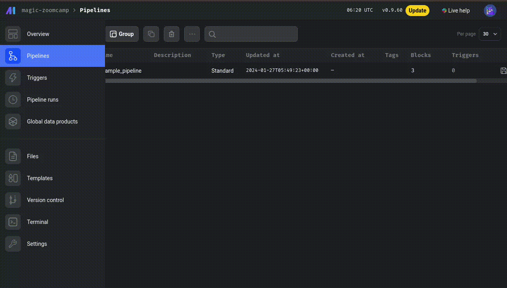
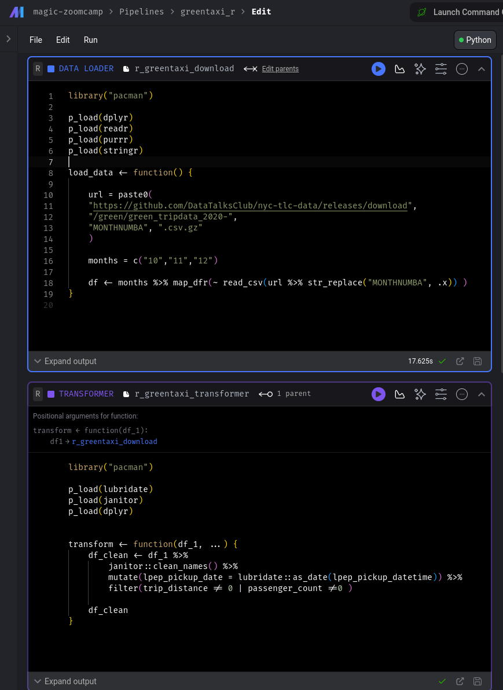

# Mage

* [Configuring Mage](#configuring-mage)
* [Configuring Postgres](#configuring-postgres)
* [Loading data from a csv file to the Postgres db](#loading-data-from-a-csv-file-to-the-postgres-db)
  + [DATA LOADER](#data-loader)
  + [TRANSFORMER](#transformer)
  + [DATA EXPORTER](#data-exporter)
* [ETL in Google Cloud Storage](#etl-in-google-cloud-storage)
  + [Configuring GCS](#configuring-gcs)
  + [Store the NY Taxi data on a Google Bucket in partitioned parquet format](#store-the-ny-taxi-data-on-a-google-bucket-in-partitioned-parquet-format)
  + [Store the NYC Taxi data in a BigQuery database](#store-the-nyc-taxi-data-in-a-bigquery-database)
* [Main Takeaways](#main-takeaways)
  + [`docker-compose.yaml`](#docker-composeyaml)
  + [`io_config.yaml`](#io_configyaml)
  + [Blocks are reusable - Great! But be careful!](#blocks-are-reusable---great-but-be-careful)
  + [Use the tree view to connect imported existing Blocks](#use-the-tree-view-to-connect-imported-existing-blocks)
  + [You can use R!!!](#you-can-use-r)

The repo with the links to all videos and slides is [at this link](https://github.com/DataTalksClub/data-engineering-zoomcamp/tree/main/02-workflow-orchestration). Here there will be only some notes for the practical part. The parts relative to parametrized execution and deployment should also be reviewed on the github page.

## Configuring Mage
[video](https://www.youtube.com/watch?v=tNiV7Wp08XE)

We will be running Mage from a docker container. Matt has prepared the docker compose yaml for us in [this repo](https://github.com/mage-ai/mage-zoomcamp).

Go ahead and clone it in the local dir.

```bash
git clone https://github.com/mage-ai/mage-zoomcamp.git
```

after that `cp dev.env .env`, because we will have some secrets in the .env, which is also in the .gitignore (we don't want to share secrets with anybody ;))

Then we can run `docker compose build` (NB: 3.49GB!)

At some point in the future, we will be prompted to update Mage. To do so:

```bash
docker pull mageai/mageai:latest
```

Finally, we can fire up the pulled image with `docker compose up`

At this point, **Mage is available at `localhost:6789`**

For this course, we are running the Postgres and the core Mage service.

Follow up: a [~3 min demo video](https://www.youtube.com/watch?v=stI-gg4QBnI&list=PL3MmuxUbc_hJed7dXYoJw8DoCuVHhGEQb) featuring the "hello world" of the data world (i.e. the Titanic dataset)


## Configuring Postgres
[video](https://www.youtube.com/watch?v=pmhI-ezd3BE)

Here we will configure the Postgres connection so that it can talk to the Postgres server/db which exists in the container we are using for the course.

We can quickly check that the postgres server is running in a couple of ways: first, simply by checking the output of `docker ps`. Also - at the risk of being pedantic - we can enter the container with a shell and then connect with `psql`

```bash
docker exec -it [container name/ID] sh
psql -h localhost -p 5432 -U postgres -d postgres
```

To use the postgres server in our pipeline, we first need to define a profile where we pass our credentials.

Note that in the `postgres` section of the `docker-compose.yml` file we specify a file of **environmental variables** `.env`. This is a way to prevent sharing our uname/pw with the rest of the world, provided that we put the `.env` file in out `.gitignore`.

Now we can go to the Mage gui, open Files and edit the `io_config.yaml`.
At the bottom we can create a `dev` environment where we specify how to retrieve our credentials. This is done in [Jinja](https://en.wikipedia.org/wiki/Jinja_(template_engine)) style using the `env_var()` function:

```bash
dev:
  POSTGRES_CONNECT_TIMEOUT: 10
  POSTGRES_DBNAME: "{{ env_var('POSTGRES_DBNAME') }}"
  POSTGRES_SCHEMA: "{{ env_var('POSTGRES_SCHEMA') }}" # Optional
  POSTGRES_USER: "{{ env_var('POSTGRES_USER') }}"
  POSTGRES_PASSWORD: "{{ env_var('POSTGRES_PASSWORD') }}"
  POSTGRES_HOST: "{{ env_var('POSTGRES_HOST') }}"
  POSTGRES_PORT: "{{ env_var('POSTGRES_PORT') }}"
```

Once we are done with that, we can test the connection with a simple pipeline (if we dare calling it like that) which just executes a `SELECT 1` query from postgres. The steps are shown in the animation below. Note that we are using the `dev` profile we just created.




## Loading data from a csv file to the Postgres db
[video](https://www.youtube.com/watch?v=Maidfe7oKLs)

### DATA LOADER
Create a new pipeline and insert a Python >> API data loader. We will be presented with the template.

We then replace the url with the location of the Yellow Taxi data (see below) and - as Matt suggests - we pass the dtype of the columns, also prompting pandas to parse the two datetime columns `'tpep_pickup_datetime','tpep_dropoff_datetime'`.

The code for the dtypes is provided on screen, but rather than visually cp/paste, I just read them with a python container I had dangling around:

```bash
docker run --rm -it python:3.9 /bin/bash
```

```python
import pandas as pd

url='https://github.com/DataTalksClub/nyc-tlc-data/releases/download/yellow/yellow_tripdata_2021-01.csv.gz'

df = pd.read_csv(url, sep=',', compression="gzip", nrows=10)

for col in df.columns:
    print(f"'{col} : '")
```

After modifying the pipeline, it looks like this:

```python
url='https://github.com/DataTalksClub/nyc-tlc-data/releases/download/yellow/yellow_tripdata_2021-01.csv.gz'

taxi_dtypes = {
    'VendorID' : pd.Int64Dtype(),
    'passenger_count' : pd.Int64Dtype(),
    'trip_distance' : float,
    'RatecodeID' : pd.Int64Dtype(),
    'store_and_fwd_flag' : str,
    'PULocationID' : pd.Int64Dtype(),
    'DOLocationID' : pd.Int64Dtype(),
    'payment_type' : pd.Int64Dtype(),
    'fare_amount' : float,
    'extra' : float,
    'mta_tax' : float,
    'tip_amount' : float,
    'tolls_amount' : float,
    'improvement_surcharge' : float,
    'total_amount' : float,
    'congestion_surcharge' : float,
}

parse_dates = ['tpep_pickup_datetime','tpep_dropoff_datetime']

return pd.read_csv(url, sep=',', compression="gzip", dtype=taxi_dtypes, parse_dates=parse_dates)
```

Now we can run it and inspect the output below, which also informs us that the test has been passed.

### TRANSFORMER
Next we can add the **Transform** part of the pipeline. Add a generic Python TRANSFORMER block and call it `transform_taxi_data`.

We will carry out a simple transformation, only removing the rows recording the taxi rides with 0 passengers. We will also write a simple test which confirms that there are no more rides with no passengers, otherwise print a message.

```python
if 'transformer' not in globals():
    from mage_ai.data_preparation.decorators import transformer
if 'test' not in globals():
    from mage_ai.data_preparation.decorators import test


@transformer
def transform(data, *args, **kwargs):

    nrows_zero=(data['passenger_count']==0).sum()
    print(f'Rows with 0 passengers: {nrows_zero}')


    return data[data['passenger_count'] > 0 ]


@test
def test_output(output, *args):
    assert output['passenger_count'].isin([0]).sum() == 0, "There are rides with 0 passengers"
```

### DATA EXPORTER
Now we load the transformed data into Postgres. To do so add an SQL DATA EXPORTER block and make sure that the df is set to Postgres and the profile to dev.

Note that in the whole template _we just need to modify two variables_ (!), and specifically the `schema_name` and the `table_name`

```python
from mage_ai.settings.repo import get_repo_path
from mage_ai.io.config import ConfigFileLoader
from mage_ai.io.postgres import Postgres
from pandas import DataFrame
from os import path

if 'data_exporter' not in globals():
    from mage_ai.data_preparation.decorators import data_exporter


@data_exporter
def export_data_to_postgres(df: DataFrame, **kwargs) -> None:
    """
    Template for exporting data to a PostgreSQL database.
    Specify your configuration settings in 'io_config.yaml'.

    Docs: https://docs.mage.ai/design/data-loading#postgresql
    """
    schema_name = 'ny_taxi'  # Specify the name of the schema to export data to
    table_name = 'yellow_cab_data'  # Specify the name of the table to export data to
    config_path = path.join(get_repo_path(), 'io_config.yaml')
    config_profile = 'dev'

    with Postgres.with_config(ConfigFileLoader(config_path, config_profile)) as loader:
        loader.export(
            df,
            schema_name,
            table_name,
            index=False,  # Specifies whether to include index in exported table
            if_exists='replace',  # Specify resolution policy if table name already exists
        )
```

Once we have run the whole pipeline (it will take about a minute due to the amount of data), we will have our yellow taxi data in Postgres.

To make sure everything is there, we can add a new SQL DATA LOADER using raw SQL and just issue a simple query such as

```sql
SELECT * FROM ny_taxi.yellow_cab_data LIMIT 10
```

(As usual, be careful with the SELECT *)

And that's all for now!


## ETL in Google Cloud Storage

So far we have ingested the data to a local postgres db. What if we want to put them in Google Cloud Storage? (GCS)

### Configuring GCS
[video](https://www.youtube.com/watch?v=00LP360iYvE)

Pretty simple. So here's a summary and just a few things to be careful about below:

**Summary**:
- create a bucket in GCS
- create a service account and the keys
- make sure Mage knows where the keys are in the `io_config.yaml` file
- create a pipeline with a BigQuery DATA LOADER and SELECT 1 to test it
- drop the titanic_clean.csv in the bucket
- create a pipeline with a python data loader from Google Cloud Storage (_not_ BigQuery)
- run it to test that it loaded the data in the bucket
- (destroy the keys!)


When **creating the bucket**, make sure you select the proper region and note that a multi-region storage costs a bit more. Also, make sure you prevent public access to the bucket.

For the sake of the tutorial, we give the **service account** full permission to do the hell out of GCS. Be careful with that (hence the keys destroy at the end...)

In the `io_config.yaml` file you will notice that you can cp/paste your credentials in clear (AUFKM??... Wipe out those lines!) or pass the location of the json with the keys (much better...). Look for the line:

```bash
GOOGLE_SERVICE_ACC_KEY_FILEPATH: "/home/src/my_very_secret_keys.json"
```

Note that the path is to `/home/src` because we defined in the docker compose file that the $PWD from which we fire up docker compose is mapped there. You can also check by ls in the terminal inside Mage

(Currently the $PWD is in the github repo so this is also not a great idea. Remember to destroy those keys when you are done)

In the **python pipeline** to load the `titanic_clean.csv` you only need to update two lines:

```bash
bucket_name = 'mage-zoomcamp-leonardo-machinery'
object_key = 'titanic_clean.csv'
```

### Store the NY Taxi data on a Google Bucket in partitioned parquet format
[video](https://www.youtube.com/watch?v=w0XmcASRUnc)

First let's quickly write the NY taxi dataset to a single parquet file.

To do this, we can reuse the components we previously created for the local postgres.


But let's see something more interesting, i.e. how to store the data in a partitioned parquet file. This is particularly useful for quick access to large datasets.

We first create a generic python DATA EXPORTER with no template. Now we want to:
- manually define the location of the credentials
- use **Apache Arrow** to write the data in a partitioned parquet


Here's the final code:

```python
import pyarrow as pa
import pyarrow.parquet as pq
import os

if 'data_exporter' not in globals():
    from mage_ai.data_preparation.decorators import data_exporter

os.environ['GOOGLE_APPLICATION_CREDENTIALS'] = "/home/src/mykeys.json"

# project_id = 'de-zoomcamp-001'

bucket_name = 'mage-zoomcamp-leonardo-machinery'
table_name = 'nyc_taxi_data'

root_path = f'{bucket_name}/{table_name}'


@data_exporter
def export_data(data, *args, **kwargs):

    # Create a column to partition the data by day
    data['tpep_pickup_date'] = data['tpep_pickup_datetime'].dt.date

    # define a pyarrow table
    table = pa.Table.from_pandas(data)

    # Create a filesystem interface to interact with GCS
    gcs = pa.fs.GcsFileSystem()

    # Write the table to a partitioned parquet
    pq.write_to_dataset(
        table,
        root_path=root_path,
        partition_cols = ['tpep_pickup_date'],
        filesystem = gcs
    )
```

### Store the NYC Taxi data in a BigQuery database
[video](https://www.youtube.com/watch?v=JKp_uzM-XsM)

- DATA LOAD : load the single file parquet from GCS
- TRANSFORMERS : replace spaces in the column names with underscores, and lower all capital letters
- DATA EXPORT : export to BigQuery defining the schema (ny_taxi) and table name (yellow_cab_data) using an SQL

Nothing transcendental here. Mage makes it really easy to create the pipeline :O)

Worth noting:

The python logic to fix the column names is very simple and elegant:

```python
data.columns = (
        data.columns
        .str.replace(" ","_")
        .str.lower()
    )
```

In the SQL exporter the data coming from the transformer can be selected using `{{ df_1 }}`, so we can import it simply with

```SQL
select * from  {{ df_1 }}
```

**Triggers**
In the last part of the video it is mentioned how to create a trigger for the pipeline to run.

It is just to easy to do so with Mage, so just open the trigger tab and let Mage guide you! :))


## Main Takeaways
Mage is really MAGEIK! The UI is very well designed, which makes building a pipeline not only easy but also a lot fun!

For this reason, here I will just remind (myself) of some aspects to keep in mind which are not - at least for me at this stage - already evident from the interface.

### `docker-compose.yaml`
Since it's so handy to run Mage in Docker, you can personalize the docker-compose file according to all the - local - services you want to interact with it. For instance, in our tut Matt prepared a file containing also a Postgres service

<details><summary>toggle docker-compose.yaml</summary>
version: '3'
services:
  magic:
    image: mageai/mageai:latest
    command: mage start ${PROJECT_NAME}
    env_file:
      - .env
    build:
      context: .
      dockerfile: Dockerfile
    environment:
      USER_CODE_PATH: /home/src/${PROJECT_NAME}
      POSTGRES_DBNAME: ${POSTGRES_DBNAME}
      POSTGRES_SCHEMA: ${POSTGRES_SCHEMA}
      POSTGRES_USER: ${POSTGRES_USER}
      POSTGRES_PASSWORD: ${POSTGRES_PASSWORD}
      POSTGRES_HOST: ${POSTGRES_HOST}
      POSTGRES_PORT: ${POSTGRES_PORT}
    ports:
      - 6789:6789
    volumes:
      - .:/home/src/
      - ~/Documents/secrets/personal-gcp.json:/home/src/personal-gcp.json
    restart: on-failure:5
  postgres:
    image: postgres:14
    restart: on-failure
    container_name: ${PROJECT_NAME}-postgres
    env_file:
      - .env
    environment:
      POSTGRES_DB: ${POSTGRES_DBNAME}
      POSTGRES_USER: ${POSTGRES_USER}
      POSTGRES_PASSWORD: ${POSTGRES_PASSWORD}
    ports:
      - "${POSTGRES_PORT}:5432"
</details>


### `io_config.yaml`
Lots of things are going on in here. What we saw in the tut is that:

1) here you define the location of the .json credentials to connect to Google Cloud,

```bash
GOOGLE_SERVICE_ACC_KEY_FILEPATH: "/home/src/keys.json"
```
so be careful to where you put them wrt to your .gitignore

2) here's also the place where you define different environments, such as `dev` or `prod`, e.g.

<details><summary>toggle dev profile in the io_config.yaml file</summary>

```bash
dev:
  POSTGRES_CONNECT_TIMEOUT: 10
  POSTGRES_DBNAME: "{{ env_var('POSTGRES_DBNAME') }}"
  POSTGRES_SCHEMA: "{{ env_var('POSTGRES_SCHEMA') }}" # Optional
  POSTGRES_USER: "{{ env_var('POSTGRES_USER') }}"
  POSTGRES_PASSWORD: "{{ env_var('POSTGRES_PASSWORD') }}"
  POSTGRES_HOST: "{{ env_var('POSTGRES_HOST') }}"
  POSTGRES_PORT: "{{ env_var('POSTGRES_PORT') }}"
```
</details>


### Blocks are reusable - Great! But be careful!
This is of course a _great_ thing, but you should be careful as well:

- if you reuse a component from pipeline A in pipeline B but modify it in pipeline B, the modifications will be applied also to pipeline A

- when you delete a block from the UI, the corresponding block is _not_ deleted from the codebase. Therefore if you want to start writing it again from scratch, you should also delete it from the codebase - in the left panel - especially if you want to call the block with the same name

- if by mistake you delete from the interface a block that is present in one of the pipelines, you will get an error message when opening/running the pipeline. I was not able to just suppress this, and I had to recreate the pipeline in another pipeline

### Use the tree view to connect imported existing Blocks
If you are writing a pipeline and at some point you want to insert a pre-existing block, you just drag and drop it from the left panel.

However this block will not be automatically connected to the previous one like it would happen if you would create it from scratch from the UI. In order to establish the connection with the previous (or following) block you need to manually create the link in the tree view.

The tree view is also useful to define blocks that you can/want to run in parallel.


### You can use R!!!
Finally! In R you can create loaders, transformers and exporters using R.

This is achieved by using the `pacman` package, e.g.

```r
library("pacman")

p_load(dplyr)
p_load(readr)
p_load(purrr)
p_load(stringr)
```

The only - relatively minor - issue at the moment is that when you use a package for the first time in a new container, Mage downloads the source and compiles the package. This can take quite some time (in my case it took ~5 minutes to install some common `tidyverse` packages such as `dplyr`).

Although this is a common experience also when installing RStudio, it would be great if in the future it would be possible to just download the compiled version.

**update**: actually Xiaoyou Wang reached out on Slack and adviced to install these packages when building the image, e.g.

```bash
FROM mageai/mageai:latest

# Add code to install R pacakges
RUN \
  R -e "install.packages('tidyverse', repos='http://cran.us.r-project.org')" && \
  R -e "install.packages('dplyr', repos='http://cran.us.r-project.org')"
```

This is a great idea that effectively solves the issue above!

Another thing that R users would be greatly thankful for is the possibility of implementing a shortcut for the ubiquitous pipes: `%>%` and `|>`, for instance the familiar `CMD-Shift-M` (M for Magrittr).


Here's an example of a Data Loader and a Transformer in R

<details><summary>R DATA LOADER</summary>

```r
library("pacman")

p_load(dplyr)
p_load(readr)
p_load(purrr)
p_load(stringr)


load_data <- function() {

    url = paste0(
    "https://github.com/DataTalksClub/nyc-tlc-data/releases/download",
    "/green/green_tripdata_2020-",
    "MONTHNUMBA", ".csv.gz"
    )

    months = c("10","11","12")

    df <- months %>% map_dfr(~ read_csv(url %>% str_replace("MONTHNUMBA", .x)) )
}
```
</details>


<details><summary>TRANSFORMER</summary>

```r
library("pacman")

p_load(lubridate)
p_load(janitor)
p_load(dplyr)


transform <- function(df_1, ...) {
    df_clean <- df_1 %>%
        janitor::clean_names() %>%
        mutate(lpep_pickup_date = lubridate::as_date(lpep_pickup_datetime)) %>%
        filter(trip_distance != 0 | passenger_count !=0 )

    df_clean
}
```
</details>

<br>

Python is great, and nobody denies it. However there is nothing like the `tidyverse` to transform your tabular data.




That's all folks!
