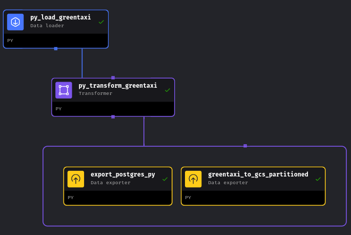
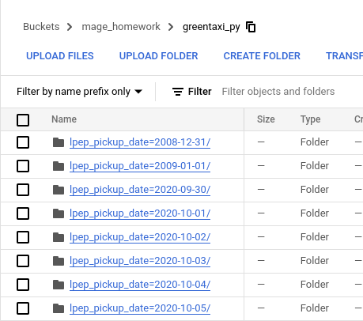
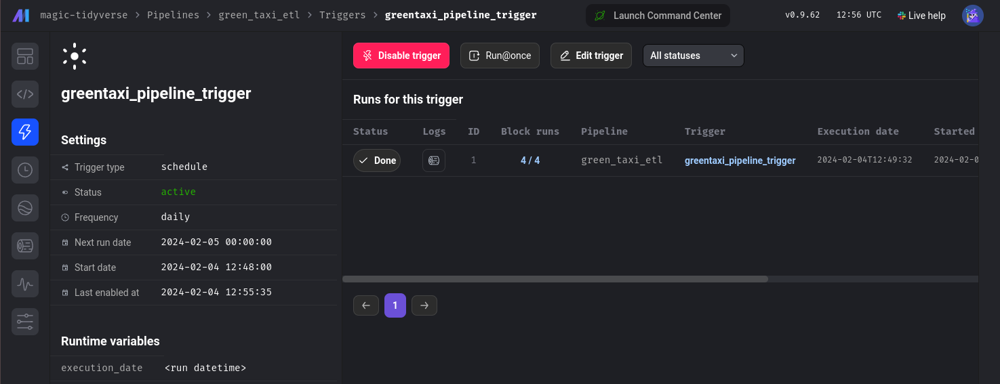

### Assignment

The goal will be to construct an ETL pipeline that loads the data, performs some transformations, and writes the data to a database (and Google Cloud!).



- Create a new pipeline, call it `green_taxi_etl`
- Add a data loader block and use Pandas to read data for the final quarter of 2020 (months `10`, `11`, `12`).
  - You can use the same datatypes and date parsing methods shown in the course.
  - `BONUS`: load the final three months using a for loop and `pd.concat`

<details><summary>toggle DATA LOADER</summary>

```python
if 'data_loader' not in globals():
    from mage_ai.data_preparation.decorators import data_loader
if 'test' not in globals():
    from mage_ai.data_preparation.decorators import test


import pandas as pd

@data_loader
def load_data(*args, **kwargs):

    df = pd.DataFrame()

    for month in 10, 11, 12:
        url=(
            f'https://github.com/DataTalksClub/nyc-tlc-data/releases/'
            f'download/green/green_tripdata_2020-{month}.csv.gz'
        )

        print(url)
        chunk = pd.read_csv(url)
        print(f'Loaded month {month}')
        df = pd.concat([df, chunk], ignore_index=True)

    return df


@test
def test_output(output, *args) -> None:
    """
    Template code for testing the output of the block.
    """
    assert output is not None, 'The output is undefined'
```
</details>
<br>


- Add a transformer block and perform the following:
  - Remove rows where the passenger count is equal to 0 _or_ the trip distance is equal to zero.
  - Create a new column `lpep_pickup_date` by converting `lpep_pickup_datetime` to a date.
  - Rename columns in Camel Case to Snake Case, e.g. `VendorID` to `vendor_id`.
  - Add three assertions:
    - `vendor_id` is one of the existing values in the column (currently)
    - `passenger_count` is greater than 0
    - `trip_distance` is greater than 0

<details><summary>toggle TRANSFORMER</summary>

```python
if 'transformer' not in globals():
    from mage_ai.data_preparation.decorators import transformer
if 'test' not in globals():
    from mage_ai.data_preparation.decorators import test

import pandas as pd

@transformer
def transform(data, *args, **kwargs):

    taxi_dtypes = {
            'VendorID' : pd.Int64Dtype(),
            'passenger_count' : pd.Int64Dtype(),
            'trip_distance' : float,
            'RatecodeID' : pd.Int64Dtype(),
            'store_and_fwd_flag' : str,
            'PULocationID' : pd.Int64Dtype(),
            'DOLocationID' : pd.Int64Dtype(),
            'payment_type' : pd.Int64Dtype(),
            'fare_amount' : float,
            'extra' : float,
            'mta_tax' : float,
            'tip_amount' : float,
            'tolls_amount' : float,
            'improvement_surcharge' : float,
            'total_amount' : float,
            'congestion_surcharge' : float,
        }

    data = data.astype(taxi_dtypes)

    # convert the lpep columns to datetiem
    data['lpep_pickup_datetime'] = pd.to_datetime(data['lpep_pickup_datetime'])
    data['lpep_dropoff_datetime'] = pd.to_datetime(data['lpep_dropoff_datetime'])


    # replace spaces with underscores and lower all capitals
    data.columns = (
        data.columns
        .str.replace(" ","_")
        .str.replace('(?<=[a-z])(?=[A-Z])', '_', regex=True) # camelCase to snake_case
        .str.lower()
    )

    # remove rides with passenger count OR trip distance = 0
    # create a new column with the date
    data = (
        data
        .query('passenger_count != 0 | trip_distance != 0')
        .assign(lpep_pickup_date = lambda x: x['lpep_pickup_datetime'].dt.date)
    )

    return data


@test
def test_output(output, *args) -> None:
    """
    Template code for testing the output of the block.
    """
    assert output is not None, 'The output is undefined'


```

</details>
<br>

- Using a Postgres data exporter (SQL or Python), write the dataset to a table called `green_taxi` in a schema `mage`. Replace the table if it already exists.
- Write your data as Parquet files to a bucket in GCP, partioned by `lpep_pickup_date`. Use the `pyarrow` library!

<details><summary>toggle DATA EXPORTER</summary>

```python
import pyarrow as pa
import pyarrow.parquet as pq
import os

if 'data_exporter' not in globals():
    from mage_ai.data_preparation.decorators import data_exporter

os.environ['GOOGLE_APPLICATION_CREDENTIALS'] = "/home/src/nu_keys.json"

# project_id = 'de-zoomcamp-001'

bucket_name = 'mage_homework'
table_name = 'greentaxi_py'

root_path = f'{bucket_name}/{table_name}'


@data_exporter
def export_data(data, *args, **kwargs):

    # Create a column to partition the data by day
    data['lpep_pickup_date'] = data['lpep_pickup_datetime'].dt.date

    # define a pyarrow table
    table = pa.Table.from_pandas(data)

    # Create a filesystem interface to interact with GCS
    gcs = pa.fs.GcsFileSystem()

    # Write the table to a partitioned parquet
    pq.write_to_dataset(
        table,
        root_path=root_path,
        partition_cols = ['lpep_pickup_date'],
        filesystem = gcs
    )
```

</details>
<br>



- Schedule your pipeline to run daily at 5AM UTC.




### Notes
Once the data have been loaded in Postgres, I wanted to check them using pgcli

In installed it in the postgres:14 container and accessed the db using the credentials in the .env file:

```bash
pgcli -h postgres -p 5432 -U postgres -d postgres
```

However I cannot see the tables using `dt`. Instead I can list them using:

```sql
SELECT table_schema, table_name
 FROM information_schema.tables
 WHERE table_schema NOT IN ('information_schema', 'pg_catalog')
 ORDER BY table_schema, table_name;

+--------------+--------------+
| table_schema | table_name   |
|--------------+--------------|
| ny_taxi      | greentaxi_py |
| ny_taxi      | greentaxi_r  |
+--------------+--------------+

```

and then select from them with the usual SQL queries, e.g.

```sql
postgres@postgres:postgres> select count(*) from ny_taxi.greentaxi_py;
+--------+
| count  |
|--------|
| 265355 |
+--------+
```

Need to revise the first module to understand what is missing.
