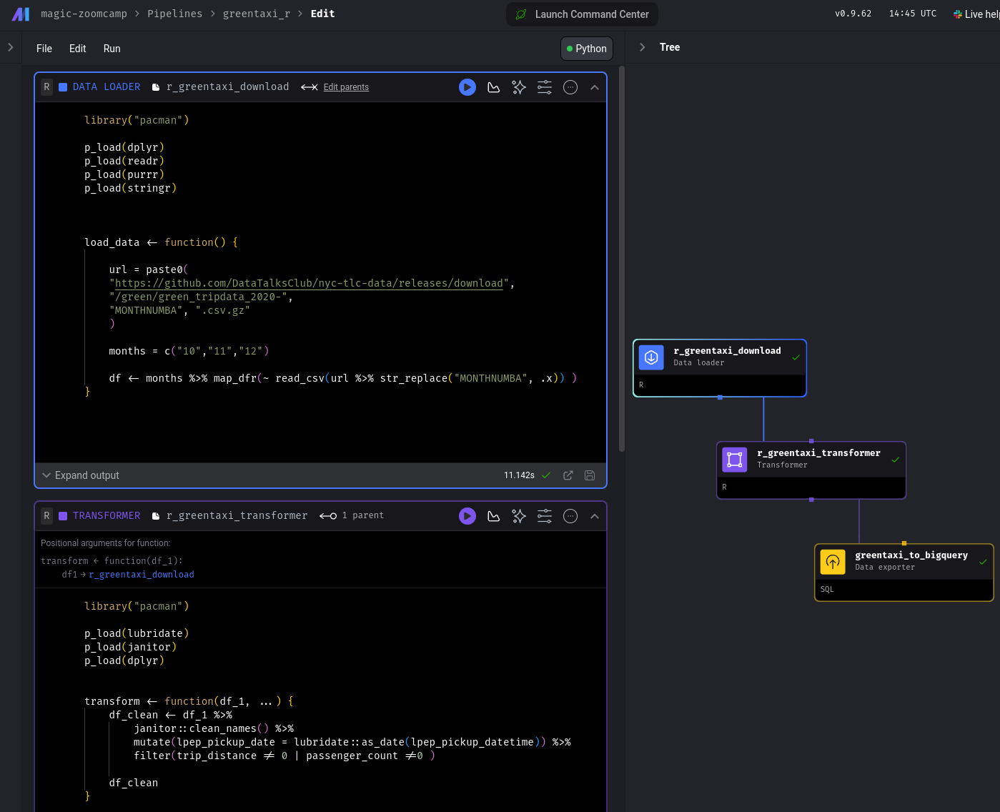

## Main Takeaways
Mage is really MAGEIK! The UI is very well designed, which makes building a pipeline not only easy but also a lot fun!

For this reason, here I will just remind (myself) of some aspects to keep in mind which are not - at least for me at this stage - already evident from the interface.

### `docker-compose.yaml`
Since it's so handy to run Mage in Docker, you can personalize the docker-compose file according to all the - local - services you want to interact with it. For instance, in our tut Matt prepared a file containing also a Postgres service

<details><summary>toggle docker-compose.yaml</summary>
version: '3'
services:
  magic:
    image: mageai/mageai:latest
    command: mage start ${PROJECT_NAME}
    env_file:
      - .env
    build:
      context: .
      dockerfile: Dockerfile
    environment:
      USER_CODE_PATH: /home/src/${PROJECT_NAME}
      POSTGRES_DBNAME: ${POSTGRES_DBNAME}
      POSTGRES_SCHEMA: ${POSTGRES_SCHEMA}
      POSTGRES_USER: ${POSTGRES_USER}
      POSTGRES_PASSWORD: ${POSTGRES_PASSWORD}
      POSTGRES_HOST: ${POSTGRES_HOST}
      POSTGRES_PORT: ${POSTGRES_PORT}
    ports:
      - 6789:6789
    volumes:
      - .:/home/src/
      - ~/Documents/secrets/personal-gcp.json:/home/src/personal-gcp.json
    restart: on-failure:5
  postgres:
    image: postgres:14
    restart: on-failure
    container_name: ${PROJECT_NAME}-postgres
    env_file:
      - .env
    environment:
      POSTGRES_DB: ${POSTGRES_DBNAME}
      POSTGRES_USER: ${POSTGRES_USER}
      POSTGRES_PASSWORD: ${POSTGRES_PASSWORD}
    ports:
      - "${POSTGRES_PORT}:5432"
</details>


### `io_config.yaml`
Lots of things are going on in here. What we saw in the tut is that:

1) here you define the location of the .json credentials to connect to Google Cloud,

```bash
GOOGLE_SERVICE_ACC_KEY_FILEPATH: "/home/src/keys.json"
```
so be careful to where you put them wrt to your .gitignore

2) here's also the place where you define different environments, such as `dev` or `prod`, e.g.

<details><summary>toggle dev profile in the io_config.yaml file</summary>

```bash
dev:
  POSTGRES_CONNECT_TIMEOUT: 10
  POSTGRES_DBNAME: "{{ env_var('POSTGRES_DBNAME') }}"
  POSTGRES_SCHEMA: "{{ env_var('POSTGRES_SCHEMA') }}" # Optional
  POSTGRES_USER: "{{ env_var('POSTGRES_USER') }}"
  POSTGRES_PASSWORD: "{{ env_var('POSTGRES_PASSWORD') }}"
  POSTGRES_HOST: "{{ env_var('POSTGRES_HOST') }}"
  POSTGRES_PORT: "{{ env_var('POSTGRES_PORT') }}"
```
</details>


### Blocks are reusable - Great! But be careful!
This is of course a _great_ thing, but you should be careful as well:

- if you reuse a component from pipeline A in pipeline B but modify it in pipeline B, the modifications will be applied also to pipeline A

- when you delete a block from the UI, the corresponding block is _not_ deleted from the codebase. Therefore if you want to start writing it again from scratch, you should also delete it from the codebase - in the left panel - especially if you want to call the block with the same name

- if by mistake you delete from the interface a block that is present in one of the pipelines, you will get an error message when opening/running the pipeline. I was not able to just suppress this, and I had to recreate the pipeline in another pipeline

### Use the tree view to connect imported existing Blocks
If you are writing a pipeline and at some point you want to insert a pre-existing block, you just drag and drop it from the left panel.

However this block will not be automatically connected to the previous one like it would happen if you would create it from scratch from the UI. In order to establish the connection with the previous (or following) block you need to manually create the link in the tree view.

The tree view is also useful to define blocks that you can/want to run in parallel.


### You can use R!!!
Finally! In R you can create loaders, transformers and exporters using R.

This is achieved by using the `pacman` package, e.g.

```r
library("pacman")

p_load(dplyr)
p_load(readr)
p_load(purrr)
p_load(stringr)
```

The only - relatively minor - issue at the moment is that when you use a package for the first time in a new container, Mage downloads the source and compiles the package. This can take quite some time (in my case it took ~5 minutes to install some common `tidyverse` packages such as `dplyr`).

Although this is a common experience also when installing RStudio, it would be great if in the future it would be possible to just download the compiled version.

Another thing that R users would be greatly thankful for is the possibility of implementing a shortcut for the ubiquitous pipes: `%>%` and `|>`, for instance the familiar `CMD-Shift-M` (M for Magrittr).



Here's an example of a Data Loader and a Transformer in R

<details><summary>R DATA LOADER</summary>

```r
library("pacman")

p_load(dplyr)
p_load(readr)
p_load(purrr)
p_load(stringr)


load_data <- function() {

    url = paste0(
    "https://github.com/DataTalksClub/nyc-tlc-data/releases/download",
    "/green/green_tripdata_2020-",
    "MONTHNUMBA", ".csv.gz"
    )

    months = c("10","11","12")

    df <- months %>% map_dfr(~ read_csv(url %>% str_replace("MONTHNUMBA", .x)) )
}
```
</details>


<details><summary>TRANSFORMER</summary>

```r
library("pacman")

p_load(lubridate)
p_load(janitor)
p_load(dplyr)


transform <- function(df_1, ...) {
    df_clean <- df_1 %>%
        janitor::clean_names() %>%
        mutate(lpep_pickup_date = lubridate::as_date(lpep_pickup_datetime)) %>%
        filter(trip_distance != 0 | passenger_count !=0 )

    df_clean
}
```
</summary>

Python is great, and nobody denies it. However there is nothing like the `tidyverse` to transform your tabular data.


That's all folks!
