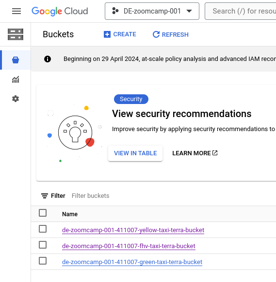
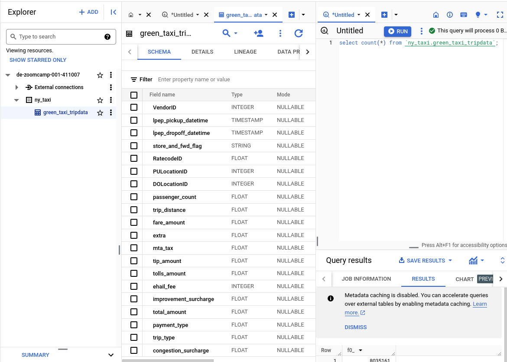

# Data Warehousing on GCS using Terraform and Mage

## Aim

[Week 3 of DE Zoomcamp](https://github.com/DataTalksClub/data-engineering-zoomcamp/tree/main/03-data-warehouse) explains the details of data warehousing in Google Cloud, including the (important) side of costs, and how to reduce them using partitioning and clustering.

The purpose of the homework is to create a data warehouse in GCS containing parquet file from the NY taxi data available [here](https://www.nyc.gov/site/tlc/about/tlc-trip-record-data.page).

Since I didn't have time this week to go through all the material, and at the same time I saw that the final result is required to work on [the Analytic Engineering in week 4](https://github.com/DataTalksClub/data-engineering-zoomcamp/tree/main/04-analytics-engineering), I set for myself a different goal:

**Preparing tables of yellow, green taxi and for-hire vehicles referred to the years 2019-2020 using as little as possible the GUI** and instead as much as possible the tools learnt in the previous weeks, that is:

- **[gcloud cli](https://cloud.google.com/sdk/gcloud) (inside a docker container)** to manage the permissions of the service account(s) used for the infrastructure management and data ingestion

- **[Terraform](https://www.terraform.io/)** to create / modify / destroy the GCS buckets

- **[Mage](https://www.mage.ai/)** to transfer the parquet files from the NY taxi data website to the GCS buckets


## Plan

- Create a new service account with no priviledges from the google cloud UI

- Pull a docker image containing the gcloud cli and carry out setting, authorization and priviledges assignment of the service account from there

- Set up the terraform files to create the GCS buckets

- Use Mage starting from the provided quickstart docker compose yaml file, and use it to transfer the parquet files to the GCS buckets

- Finally, use SQL queries to create tables from the data in GCS buckets


## Create a barebone service account and add privileges
Make sure the [google cloud cli container is available](https://cloud.google.com/sdk/docs/downloads-docker) and authenticate.

Set the project ID

```bash
docker run -it [gcloud cli IMAGE ID] /bin/bash

export service_account="dw-tf-mage"
export projectID="de-zoomcamp-001-411007"
gcloud auth login
gcloud config set project ${projectID}
gcloud config get-value project

# Give the permissions:
# - BigQuery Data Owner
# - BigQuery Job User
# - Project IAM Admin
# - Service Account User


for role in storage.admin bigquery.dataOwner bigquery.jobUser resourcemanager.projectIamAdmin iam.serviceAccountUser; do

gcloud projects add-iam-policy-binding ${projectID} \
  --member="serviceAccount:${service_account}@${projectID}.iam.gserviceaccount.com" \
  --role=roles/${role}

done

# Review the priviledges given to the service account
# https://stackoverflow.com/questions/47006062/how-do-i-list-the-roles-associated-with-a-gcp-service-account
gcloud projects get-iam-policy ${projectID}  \
--flatten="bindings[].members" \
--format='table(bindings.role)' \
--filter="bindings.members:${service_account}"

```
Afterwards, get the keys for this service account.
Note that we will store them in only one location for use with both Terraform _and_ Mage. The location is inside the `mage_dw` directory:

```bash
export GOOGLE_CREDENTIALS="./mage_DW/.keys/keys.json"
```


## Use Terraform to create the buckets
One for each of:
- yellow taxi
- green taxi
- fhv vehicles

Note in the `main.tf` file how the three buckets are created using a `for_each` loop
instead of repeating the code 3 times - since in this case the desired properties of
all buckets were the same.

```bash
# main.tf

provider "google" {
  project     = "de-zoomcamp-001-411007"
  region      = "europe-west4"
}

resource "google_storage_bucket" "taxi-bucket" {
  for_each = var.buckets

  name          = "${var.project}-${each.value}-terra-bucket"
  location      = var.location
  force_destroy = true

  lifecycle_rule {
    condition {
      age = 1
    }
    action {
      type = "Delete"
    }
  }
}
```

```bash
# variables.tf

variable "project" {
  description = "Project ID"
  default = "de-zoomcamp-001-411007"
}

variable "region" {
  description = "Region"
  default = "europe-west4"
}

variable "location" {
  description = "Project Location"
  default = "EU"
}

variable "gcs_storage_class" {
  description = "Bucket Storage Class"
  default = "STANDARD"
}

variable "buckets" {
  description = "A map of bucket names to create"
  type        = map(string)
  default     = {
    "yellow-taxi" = "yellow-taxi",
    "green-taxi"  = "green-taxi",
    "fhv-vehicles" = "fhv"
  }
}
```

```bash
terraform init
terraform plan
terraform apply
```

Now checking on GCS, we see these new buckets:



## Prepare Mage container
Clone the quickstart repo

```bash
url="https://github.com/mage-ai/compose-quickstart.git"

git clone ${url} mage_DW
cd mage_DW && cp dev.env .env && rm dev.env

# .dev will likely contain credentials
echo .env >> .gitignore

# define the name of the project manually in .env
# PROJECT_NAME=GCS_warehouse
```

Then `docker compose up` and go to `localhost:6789`

First, as usual, define the location of the Google Credentials in the `io_config.yaml` file

```bash
GOOGLE_SERVICE_ACC_KEY_FILEPATH: "/home/src/.keys/keys.json"
```

## Mage data loader : multi-parquet url to GCS bucket
We will use a python script to ingest the parquet directly from the [source url](https://www.nyc.gov/site/tlc/about/tlc-trip-record-data.page) to the destination bucket on GCS

This was done using a data loader module. In this case we don't actually build a pipeline, but again because of time restrictions here the aim was only to practice using Mage for this task - which in this particular case could have also been achieved by a standalone python script.

```python
import os
import requests
from google.cloud import storage

if 'data_loader' not in globals():
    from mage_ai.data_preparation.decorators import data_loader
if 'test' not in globals():
    from mage_ai.data_preparation.decorators import test

os.environ['GOOGLE_APPLICATION_CREDENTIALS'] = "/home/src/.keys/keys.json"

@data_loader
def load_data(*args, **kwargs):

    def upload_file_from_url_to_gcs(taxi_type, year, month, bucket_name):
        # URL and destination blob name patterns
        root_url = f"https://d37ci6vzurychx.cloudfront.net/trip-data/{taxi_type}_tripdata_"
        file_url = f"{root_url}{year}-{month:02}.parquet"
        destination_blob_name = f"{taxi_type}_tripdata_{year}-{month:02}.parquet"

        # Initialize a GCS client
        storage_client = storage.Client()
        bucket = storage_client.bucket(bucket_name)

        # Check if the blob already exists
        blob = bucket.blob(destination_blob_name)
        if blob.exists():
            print(f"File {destination_blob_name} already exists in {bucket_name}. Skipping upload.")
            return  # Skip uploading if file already exists

        # Fetch the file from the URL
        response = requests.get(file_url, stream=True)
        if response.status_code == 200:
            # Create a new blob and upload the file's content
            blob.upload_from_string(response.content, content_type='application/octet-stream')
            print(f"File from {file_url} uploaded to {bucket_name}/{destination_blob_name}.")
        else:
            print(f"Failed to fetch file from {file_url}. Status code: {response.status_code}")

    projectID = "de-zoomcamp-001-411007"

    for taxi_type in ["yellow", "green", "fhv"]:
        bucket_name = f'{projectID}-{taxi_type}-taxi-terra-bucket'  # Define bucket_name here, within the loop
        for year in [2019, 2020]:
            for month in range(1, 13):  # Loop through months 1 to 12
                upload_file_from_url_to_gcs(taxi_type, year, month, bucket_name)

    return {}


@test
def test_output(output, *args) -> None:
    """
    Template code for testing the output of the block.
    """
    assert output is not None, 'The output is undefined'

```

## Create table in BigQuery
After creating a new table `ny_taxi`, open a query and ingest the content of all of the greentaxi data

```sql
-- Ingest the content of the green taxi data from the GCS bucket
CREATE OR REPLACE EXTERNAL TABLE `de-zoomcamp-001-411007.ny_taxi.green_taxi_tripdata`
OPTIONS ( format = 'parquet',
   uris = ['gs://de-zoomcamp-001-411007-green-taxi-terra-bucket/green_tripdata_2019-*.parquet',
   'gs://de-zoomcamp-001-411007-green-taxi-terra-bucket/green_tripdata_2020-*.parquet']);
```




## Now what?

There is one column (`ehail_fee`) giving problems. The type should be fixed. For now
we can test a simple select * by excluding this column (works only in BigQuery I believe)

```sql
SELECT  
  * EXCEPT(ehail_fee)
FROM
  `de-zoomcamp-001-411007.ny_taxi.green_taxi_tripdata`
LIMIT 100;
```

Now we can go to the `mage_DW` directory and `docker compose down`.

We can also leave the `gcr.io/google.com/cloudsdktool/google-cloud-cli` container

For security, I will now delete the keys from the service account I used.
Also, the data in the bucket should be erased in one day (let's see)

##

EOF
