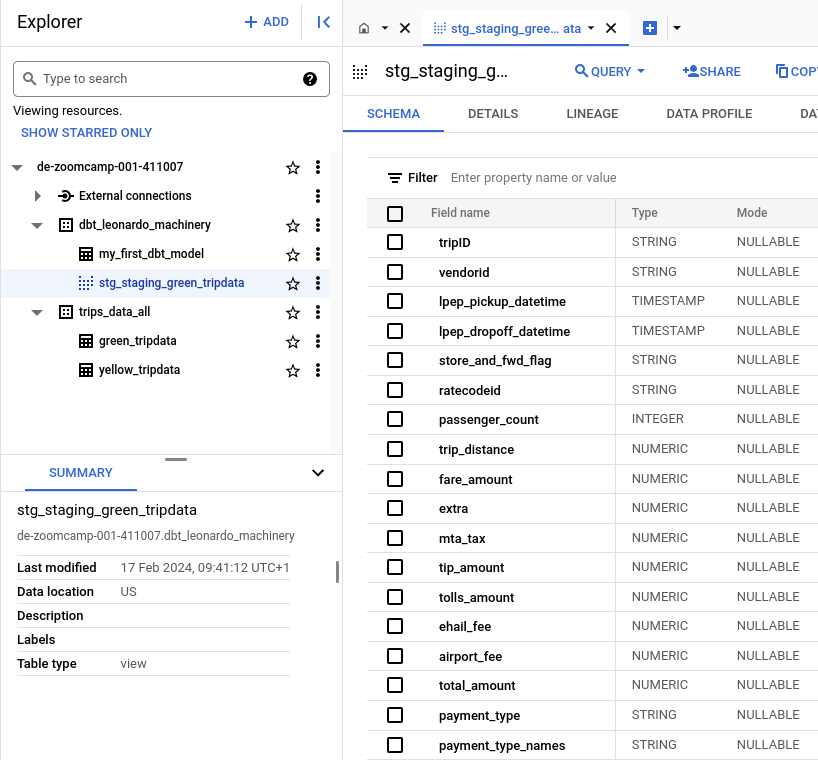
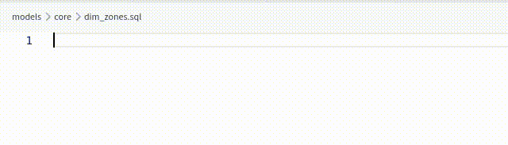

# Analytics Engineering with dbt

NB: the dbt project developed here is linked to a github repo. To find the code of the parts which are not alread below, go to [https://github.com/leonardocerliani/dbt_DE_zoomcamp_2024](https://github.com/leonardocerliani/dbt_DE_zoomcamp_2024)


* [Initial setup](#initial-setup)
  + [Prepare the NYT data in BigQuery](#prepare-the-nyt-data-in-bigquery)
  + [dbt account and project creation](#dbt-account-and-project-creation)
* [dbt project](#dbt-project)
  + [Setting up the dbt project](#setting-up-the-dbt-project)
  + [dbt project development](#dbt-project-development)
  + [Macros](#macros)
  + [Packages](#packages)
  + [Updated model](#updated-model)
  + [Variables](#variables)
  + [Next steps](#next-steps)
  + [VERY IMPORTANT FINAL STEP](#very-important-final-step)
* [Tests and documentation](#tests-and-documentation)
* [Links](#links)


## Initial setup

### Prepare the NYT data in BigQuery
[github repo](https://github.com/DataTalksClub/data-engineering-zoomcamp/tree/main/04-analytics-engineering)

To set up the environment we need to have the NYT data for yellow, green and fhv, plus the zone lookup files, in BigQuery.
The backup of these files is [here](https://github.com/DataTalksClub/nyc-tlc-data/)

To quickly load them into BigQuery we can take them from the [GCS Marketplace](https://console.cloud.google.com/marketplace/product/city-of-new-york/nyc-tlc-trips?project=de-zoomcamp-001-411007)

One you click on VIEW DATA SET you will be brought to BigQuery where you can load the data using the query you can find [here](https://github.com/DataTalksClub/data-engineering-zoomcamp/blob/main/04-analytics-engineering/taxi_rides_ny/analyses/hack-load-data.sql) and also in this repo as `hack-load-data.sql`

### dbt account and project creation

Instructions [here](https://github.com/DataTalksClub/data-engineering-zoomcamp/blob/main/04-analytics-engineering/dbt_cloud_setup.md) (parent page [here](https://github.com/DataTalksClub/data-engineering-zoomcamp/tree/main/04-analytics-engineering))

dbt BigQuery quickstart [here](https://docs.getdbt.com/guides/bigquery?step=1)

Check out the [fantastic summary from Nevenka's substack](https://datadamejourneys.substack.com/p/data-engineering-zoomcamp-week-4-2d3)


Steps to follow:

- creating a free (for developer) **dbt account** at [getdbt.com/signup](https://www.getdbt.com/signup)

- create a **BigQuery service account** for dbt with permissions for BQ Data Editor, Job User and User.
  - This can be done using the [BigQuery credential wizard](https://console.cloud.google.com/apis/credentials/wizard)
  - Create and download the keys

- create a **github repo** and link it to this project. In my case, it's the `dbt_DE_zoomcamp_2024`

- login to [getdbt.com](https://www.getdbt.com/) and create a **new dbt project**. Details below.

## dbt project
### Setting up the dbt project
[video](https://www.youtube.com/watch?v=J0XCDyKiU64)

It requires an enormous amount of boilerplate actions to create a model, so let's go through all the point-and-click nightmare in details (hopefully with the CLI it is more straightforward)

At this point you should have already:
- the GC keys for the dbt service account
- an empty github repo to store the project

1. in the dbt gui, create a new project
  - select BigQuery for the connection
  - upload the keys
  - scroll down and choose a name for the Development credentials Dataset. In my case `dbt_leonardo_machinery`
  - test the connection


2. link the github repo
  - select the Git Clone option and paste the SSH url to clone the repo
  - you will be shown a public key that you need to upload to the github repo
  - make sure you Allow write access
  - NB: you can also use an existing github repo and specify a subdirectory of it


3. start developing in the IDE
  - initialize dbt project (0-1, i.e. top-left) and 'commit and sync'
  - a boilerplate structure will be created, containing among others the file `dbt_project.yml`. However we are now in the read-only main branch
  - to edit the files, create a new branch, e.g. `dbt_zoomcamp`
    - note tha the name of the current branch is displayed in 0-1
  - change the name of the project in `dbt_project.yml` both at the beginning and in the models section of the file
  - in the `models/smaple` folder (0-0.5) you will find some example sql code
  - you can try to build it from the command line in the bottom row using `dbt build`. It will fail. (Yes, the example model from the boilerplate fails to build. Live with it.)


4. start modifying the relevant parts of `dbt_project.yml`
  - initially we just modify the name to `taxi_rides_ny` - both on top and at the bottom of the file
  - every subsequent stage should be manually recorded here (see below)

NB: Different stages of development should be recorded in the `dbt_project.yml` file. For instance we will soon create a `staging` folder where we prepare the yellow and green tables. We will also add the taxi zones lookup as a seed. Finally, we will add a `core` folder with our final model where all the three tables are merged/joined together. The final version of the bottom of the yml file will look like the following:

```yml
models:
  taxi_rides_ny:
      # Applies to all files under models/.../
      staging:
          materialized: view
      core:
          materialized: table
vars:
  payment_type_values: [1, 2, 3, 4, 5, 6]

seeds:
    taxi_rides_ny:
        taxi_zone_lookup:
            +column_types:
                locationid: numeric
```


### dbt project development
[video](https://www.youtube.com/watch?v=ueVy2N54lyc)


a model is actually a sql file. What do we put in the select from of this model?

we define the _sources_ - e.g. the BigQuery ny_taxi with its yellow and green tables - in a yml file, so that we can have a unique reference and also run tests on them before using them in the model.

we also define _seeds_, which are csv files stored in our repo. This is like a copy into command. Here the benefit is that since they are in the repo, they are version controlled, and they can be as well tested before being placed into the model

create a folder `staging` under `models` and a  `schema.yml` file inside there

```yml
version: 2

sources:
  - name: staging
    database: de-zoomcamp-001-411007
    schema: trips_data_all

    tables:
      - name: green_tripdata
      - name: yellow_tripdata
```

at this point, a `Generate model` link will appear on top of each table. Let's click the first one for the green_tripdata.

This will create two CTEs, the first one to select * from the source table, the second one to rename the columns

```sql
with
source as (
    select * from {{ source('staging', 'green_tripdata') }}
),

renamed as (
    select
        vendorid,
        lpep_pickup_datetime,
        lpep_dropoff_datetime,
        ...
        data_file_month
    from source
)
select * from renamed
```

### Macros
Macros - that is, _functions_ - in dbt are created as sql files using jinja placeholders. They are useful to
- use control structures
- env variables for deployment
- create functions encapsulating sql snippets

The nice thing is that **these fn generate sql code**, thereby simplifying and making more efficient and clear the process of writing complex queries

Create a new macro `get_payment_type_description.sql` in the `macros` folder (note that a simple `cast` will not work)

```sql
{#
    This macro returns the description of the payment_type
#}



    case {{ dbt.safe_cast("payment_type", api.Column.translate_type("integer")) }}  
        when 1 then 'Credit card'
        when 2 then 'Cash'
        when 3 then 'No charge'
        when 4 then 'Dispute'
        when 5 then 'Unknown'
        when 6 then 'Voided trip'
        else 'EMPTY'
    end


```

you notice that in a macro, `{# #}` enclose comments, `` enclose statements (like the fn definition) and `{{}}` enclose variables.

Let's try to use this in the `stg_staging_green_tripdata` by adding it in the import of a new column, which results from running the macro on the column `payment_type`

NB: the column name should be passed as a string!

```sql
select
    vendorid,
    lpep_pickup_datetime,
    lpep_dropoff_datetime,
    ...
    payment_type,

    {{ get_payment_type_description('payment_type') }} as payment_type_names

    ...
    data_file_month

from source
```

If we now **</> Compile** this, we will have the final sql code for the query:

```sql
select
    vendorid,
    lpep_pickup_datetime,
    lpep_dropoff_datetime,
    ...
    payment_type,

    case cast(payment_type  as integer)
        when 1 then 'Credit card'
        when 2 then 'Cash'
        when 3 then 'No charge'
        when 4 then 'Dispute'
        when 5 then 'Unknown'
        when 6 then 'Voided trip'
        else 'EMPTY'
    end as payment_type_names

    ...
    data_file_month

from source
```

### Packages
Several macros (why didn't they call them functions?) can be grouped in a package.

There are also already many pre-made packages in the [dbt packages hub](https://hub.getdbt.com/)

We're going to see an example of using the `dbt_utils` package.

- Create a file `packages.yml` in the root directory of the project, and place the code displayed when opening the `dbt_utils` package [page](https://hub.getdbt.com/dbt-labs/dbt_utils/latest/)
```yml
packages:
  - package: dbt-labs/dbt_utils
    version: 1.1.1
```

- Go to the corresponding [github repo](https://github.com/dbt-labs/dbt-utils/tree/1.1.1) - also displayed on the dbt utils page - and check the doc for the `generate_surrogate_key` macro
```sql
{{ dbt_utils.generate_surrogate_key(['field_a', 'field_b'[,...]]) }}
```
- Insert the code into our `stg_staging_green_tripdata.sql`
```sql
select
    {{ dbt_utils.generate_surrogate_key(['vendorid', 'lpep_pickup_datetime']) }} as tripID,
    vendorid,
    lpep_pickup_datetime,
    ...
```

- This will compile to the following
```sql
select
    to_hex(md5(cast(coalesce(cast(vendorid as string), '_dbt_utils_surrogate_key_null_') || '-' || coalesce(cast(lpep_pickup_datetime as string), '_dbt_utils_surrogate_key_null_') as string))) as tripID,
    vendorid,
    lpep_pickup_datetime,
```

Note that the macros automatically adapt to the platform we are using, so for instance in Postgres the compiled sql will look slightly different.

- Compile and make sure it goes well. You can also check at any time the compiled code in the `target/compiled/[project_name]/models/staging/stg_staging_green_tripdata.sql`

- If we now move to BigQuery, we can see the outcome of what dbt did:



### Updated model
These examples allow us to create a complete preprocessing of the greentaxi data, and shown in the code presented [here](https://github.com/DataTalksClub/data-engineering-zoomcamp/blob/main/04-analytics-engineering/taxi_rides_ny/models/staging/stg_green_tripdata.sql) and below


`stg_green__tripdata.sql`

```sql
{{config(materialized='view')}}

with tripdata as
(
  select *,
    row_number() over(partition by vendorid, lpep_pickup_datetime) as rn
  from {{ source('staging','green_tripdata') }}
  where vendorid is not null
)
select
    -- identifiers
    {{ dbt_utils.generate_surrogate_key(['vendorid', 'lpep_pickup_datetime']) }} as tripid,
    {{ dbt.safe_cast("vendorid", api.Column.translate_type("integer")) }} as vendorid,
    {{ dbt.safe_cast("ratecodeid", api.Column.translate_type("integer")) }} as ratecodeid,
    {{ dbt.safe_cast("pulocationid", api.Column.translate_type("integer")) }} as pickup_locationid,
    {{ dbt.safe_cast("dolocationid", api.Column.translate_type("integer")) }} as dropoff_locationid,

    -- timestamps
    cast(lpep_pickup_datetime as timestamp) as pickup_datetime,
    cast(lpep_dropoff_datetime as timestamp) as dropoff_datetime,

    -- trip info
    store_and_fwd_flag,
    {{ dbt.safe_cast("passenger_count", api.Column.translate_type("integer")) }} as passenger_count,
    cast(trip_distance as numeric) as trip_distance,
    {{ dbt.safe_cast("trip_type", api.Column.translate_type("integer")) }} as trip_type,

    -- payment info
    cast(fare_amount as numeric) as fare_amount,
    cast(extra as numeric) as extra,
    cast(mta_tax as numeric) as mta_tax,
    cast(tip_amount as numeric) as tip_amount,
    cast(tolls_amount as numeric) as tolls_amount,
    cast(ehail_fee as numeric) as ehail_fee,
    cast(improvement_surcharge as numeric) as improvement_surcharge,
    cast(total_amount as numeric) as total_amount,
    coalesce({{ dbt.safe_cast("payment_type", api.Column.translate_type("integer")) }},0) as payment_type,
    {{ get_payment_type_description("payment_type") }} as payment_type_description
from tripdata
where rn = 1


-- dbt build --select <model name> --vars '{"is_test_run":False}'


  limit 100


```

### Variables
In the last lines of the code above we can see the use of variables in dbt. In standard sql we use CTEs to store variables.

In dbt we can use **variables at the project level, i.e. defined in the dbt_project.yml file**, e.g.

```sql
-- in project.yml
vars:
  payment_type_values: [1, 2, 3, 4, 5]
```


Or inside functions
```sql
/*
  if you don't want to limit to 100 rows, use
  dbt build --select <model name> --vars '{"is_test_run":False}'
*/

  limit 100

```

And then at the command line, sent as a dictionary
```bash
dbt build --vars '{"is_test_run":False}'
```

NDC: personally I would set the default to true and ask to explicitly specify the limit in development, to avoid that production data only has 100 rows (!)

### Next steps

Lots more steps to go, but few new concepts. The code is [here](https://github.com/DataTalksClub/data-engineering-zoomcamp/tree/main/04-analytics-engineering/taxi_rides_ny)

- create the seed with the `taxi_zone_lookup.csv` and build it - this will also create the corresponding table in BigQuery

- create a `core` filder in the model

- create a `core/dim_zones.sql` to import the zone lookup seed (tip : use autocompletion!)



- create a `fact_trips.sql` table containing both green and yellow data, and enrich it with the zones from the taxi_zones table we just created


### VERY IMPORTANT FINAL STEP
When all the model is in place, remember to run it for _all_ rows, not just for the first 100 rows as by default in the yellow/green staging sql!

To do so we choose to run a `Build +model+ (Up/downstream)

```bash
dbt build --select +fact_trips+ --vars '{"is_test_run":False}'
```

## Tests and documentation
[Video](https://www.youtube.com/watch?v=2dNJXHFCHaY)

## Links
- The usual [great notes by Alvaro Navas](https://github.com/ziritrion/dataeng-zoomcamp/blob/main/notes/4_analytics.md)

EOF
